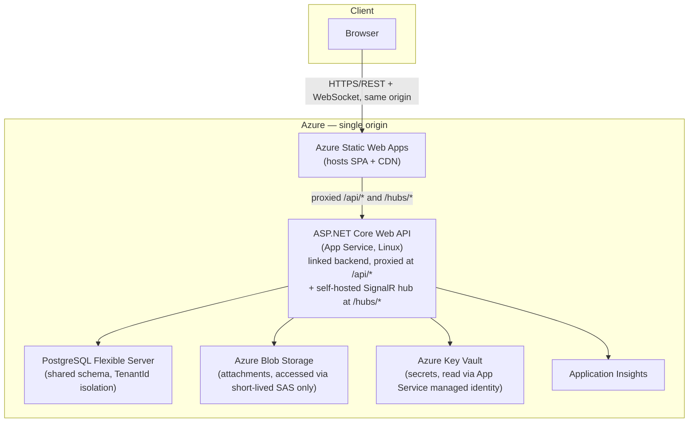

# DevFlow

A multi-tenant SaaS project management platform (a Kanban-style Jira/Linear
hybrid) — projects, boards, tasks, team management, real-time
collaboration, notifications, file attachments, a reporting dashboard, and
global search, behind organization-scoped tenancy and role-based access
control.

This is a solo-built portfolio project. The full engineering design
documentation — product requirements, architecture decisions, security
model, database design, and the hard engineering problems this system
solves — lives in [`docs/devflow/`](docs/devflow/README.md). This file
covers what you need to run it and deploy it.

## Screenshots

_Not included in this snapshot of the repository — this environment has no
way to run the full stack against a real PostgreSQL instance or open a
browser to capture them. Once deployed (or run locally per below), add
screenshots of the dashboard, board, and global search here._

## Architecture overview



The frontend and API are deployed **same-origin**: Azure Static Web Apps'
linked-backend feature proxies `/api/*` and `/hubs/*` through to the API
under the SPA's own domain, so the browser never makes a cross-origin
request. This is what makes the `HttpOnly, SameSite=Strict` refresh-token
cookie work at all — full reasoning in
[`docs/devflow/05-technical-decisions.md`](docs/devflow/05-technical-decisions.md)
ADR 6.

Backend layering is Clean Architecture (Domain → Application →
Infrastructure → API), with pragmatic application services rather than a
command/handler per operation, and MediatR used narrowly for post-commit
domain-event fan-out (activity log, notifications, real-time broadcast) —
see ADR 1 in the same document. Tenant isolation is enforced structurally
via EF Core global query filters, not per-query convention — see
[`docs/devflow/04-security.md`](docs/devflow/04-security.md) §2.

**Two deliberate simplifications versus the originally-drafted design**,
both load-bearing for this deployment and documented as such rather than
accidental:

- **Self-hosted SignalR**, not Azure SignalR Service. Real-time updates run
  directly on the single API App Service instance (`app.MapHub<TaskHub>`
  in `src/DevFlow.Api/Program.cs`). This works because the deployment is a
  single instance with no horizontal scale-out — introducing Azure SignalR
  Service becomes necessary the moment that stops being true, since
  self-hosted WebSocket state doesn't survive instance rebalancing.
- **No `/api/v1/` versioning prefix.** Endpoints are `/api/projects`,
  `/api/tasks`, etc. An earlier design draft specified versioning; it was
  never load-bearing at this project's stage and was simplified away
  during implementation.

## Tech stack

| Layer | Choice |
|---|---|
| Frontend | React 19 + TypeScript, Vite, TanStack Query, Zustand, Tailwind CSS |
| Backend | ASP.NET Core 8 Web API (C#), EF Core (Npgsql), FluentValidation, MediatR |
| Database | PostgreSQL (Azure Database for PostgreSQL Flexible Server in production) |
| Real-time | ASP.NET Core SignalR (self-hosted) |
| File storage | Azure Blob Storage, accessed only via server-issued short-lived SAS URLs |
| Auth | ASP.NET Core Identity + JWT (access token + cookie-based refresh token) |
| Secrets | Azure Key Vault (production), .NET User Secrets (local) |
| Observability | Application Insights (via the Azure Monitor OpenTelemetry distro) + Serilog |
| IaC | Bicep ([`infra/`](infra/README.md)) |
| CI/CD | GitHub Actions ([`.github/workflows/`](.github/workflows)) |

## Local development

### Prerequisites

- .NET 8 SDK (pinned via [`global.json`](global.json))
- Node.js 20+
- Docker (for PostgreSQL, Azurite, and MailHog via `docker-compose.yml`)

### 1. Start local infrastructure

```bash
cp .env.example .env   # set DEV_DB_PASSWORD to any local-only value
docker compose up -d
```

This starts PostgreSQL (`localhost:5432`), Azurite (Blob Storage emulator,
unused by default — see below), and MailHog. See
[`docs/devflow/01-architecture.md`](docs/devflow/01-architecture.md) §9 for
the full local-substitute table.

### 2. Configure secrets

The API refuses to start without a `Jwt:SigningKey`, and the default
connection string in `appsettings.Development.json` has a placeholder
password — both are supplied via .NET User Secrets, never committed:

```bash
cd src/DevFlow.Api
dotnet user-secrets set "Jwt:SigningKey" "$(openssl rand -base64 32)"
dotnet user-secrets set "ConnectionStrings:DevFlowDatabase" \
  "Host=localhost;Port=5432;Database=devflow;Username=devflow;Password=<your DEV_DB_PASSWORD>"
```

File attachments default to `LocalFileBlobStorageService` (a filesystem
substitute under `App_Data/`) unless `Storage:Azure:ConnectionString` is
set — nothing to configure to try that feature locally.

### 3. Apply migrations

```bash
dotnet tool install --global dotnet-ef   # once
dotnet ef database update \
  --project src/DevFlow.Infrastructure/DevFlow.Infrastructure.csproj \
  --startup-project src/DevFlow.Api/DevFlow.Api.csproj
```

### 4. Run it

```bash
dotnet run --project src/DevFlow.Api        # API on http://localhost:5187
cd client && npm install && npm run dev     # SPA on http://localhost:5173
```

The Vite dev server proxies `/api/*` and `/hubs/*` to the API (see
`client/vite.config.ts`) — the browser only ever talks to
`localhost:5173`, mirroring the production same-origin setup.

### Tests

```bash
dotnet test DevFlow.sln                     # backend (Sqlite in-memory, no Docker needed)
cd client && npm run lint && npm run build  # frontend lint + typecheck + build
```

## Deployment

Full walkthrough, including the exact `az deployment group create` command
and the migrations strategy, is in [`infra/README.md`](infra/README.md).
Summary:

1. **Provision Azure infrastructure** via [`infra/main.bicep`](infra/main.bicep) — App
   Service, Static Web App (linked backend), PostgreSQL Flexible Server,
   Blob Storage, Key Vault, and Application Insights.
2. **Configure GitHub Actions secrets** (repo Settings → Secrets and
   variables → Actions), built from that deployment's outputs:

   | Secret | Purpose |
   |---|---|
   | `AZURE_CLIENT_ID`, `AZURE_TENANT_ID`, `AZURE_SUBSCRIPTION_ID` | OIDC federated-credential login for `deploy-api` (no stored client secret) |
   | `AZURE_API_APP_NAME` | App Service name the API deploys to |
   | `AZURE_STATIC_WEB_APPS_API_TOKEN` | SWA's own deployment token |
   | `AZURE_POSTGRES_CONNECTION_STRING` | Used only to run the migration bundle in CI — the running API itself gets this from Key Vault, not from GitHub |

3. **Push to `main`.** [`.github/workflows/deploy.yml`](.github/workflows/deploy.yml)
   builds and tests both projects, applies pending EF Core migrations via a
   self-contained migration bundle, then deploys the API to App Service and
   the SPA to Static Web Apps.

Pull requests instead run [`.github/workflows/ci.yml`](.github/workflows/ci.yml)
— backend build + test, frontend lint + build — without deploying anything.

### Secrets handling

Nothing sensitive is ever committed or stored as plain App Service
configuration. `KeyVault:Uri` (not itself a secret — just an endpoint) is
the one App Service setting Bicep writes directly; at startup
(`src/DevFlow.Api/Program.cs`) the API uses that to pull `Jwt:SigningKey`,
`ConnectionStrings:DevFlowDatabase`, `Storage:Azure:ConnectionString`, and
`ApplicationInsights:ConnectionString` from Key Vault, authenticating via
the App Service's system-assigned managed identity
(`DefaultAzureCredential`) — no client secret exists anywhere in this path.
Full mapping of Key Vault secret names to configuration keys is in
[`infra/README.md`](infra/README.md#secrets-handling).

## Project structure

```
src/
  DevFlow.Domain/          # Entities, enums — no external dependencies
  DevFlow.Application/     # Application services, validation, DTOs, domain events
  DevFlow.Infrastructure/  # EF Core DbContext, migrations, Postgres full-text search
  DevFlow.Api/             # Controllers, auth, SignalR hub, DI composition
  DevFlow.Web/             # Local/alternative static host for the built SPA — not the production deployment target (that's Static Web Apps, see infra/)
client/                    # React SPA
tests/
  DevFlow.IntegrationTests/  # Application-service tests (Sqlite) + full-pipeline HTTP tests
infra/                      # Bicep infrastructure-as-code
docs/devflow/                # Full design documentation (PRD, architecture, security, ADRs)
.github/workflows/           # CI (PRs) and deploy (main) pipelines
```

## Known limitations

- **No refresh token.** `/auth/login`/`/auth/register` issue only a
  15-minute JWT access token — no refresh token, no `/auth/logout`. A
  session simply stops working after 15 minutes and the SPA redirects to
  `/login`. An earlier design draft specified rotated refresh tokens in an
  `HttpOnly` cookie; it was never built — see the revision note in
  [`docs/devflow/05-technical-decisions.md`](docs/devflow/05-technical-decisions.md)
  ADR 3.
- **Three-tier role model, not four.** `TenantRole` is `Member | Admin |
  Owner` — no `Viewer` role, despite one being described in an earlier
  draft of [`docs/devflow/04-security.md`](docs/devflow/04-security.md).
- **No email delivery.** Invitations return a raw token in the API
  response for the inviter to share manually; there's no SendGrid
  integration or background worker, despite both being described in an
  earlier architecture draft — see the revision note in
  [`docs/devflow/01-architecture.md`](docs/devflow/01-architecture.md) §6.
- `AzureBlobStorageService` and `PostgresFullTextSearchService` (real
  Postgres `tsvector`/`ts_rank` full-text search) are not exercised by the
  automated test suite — both require a live Azure Storage account and a
  real PostgreSQL instance respectively, neither available in every
  development environment. Their portable substitutes
  (`LocalFileBlobStorageService`, `LikeSearchService`) are what the test
  suite actually runs against, and are what prove the *contract* each
  interface upholds (tenant isolation, pagination, ranking behavior) even
  though the production implementation itself isn't directly covered.
