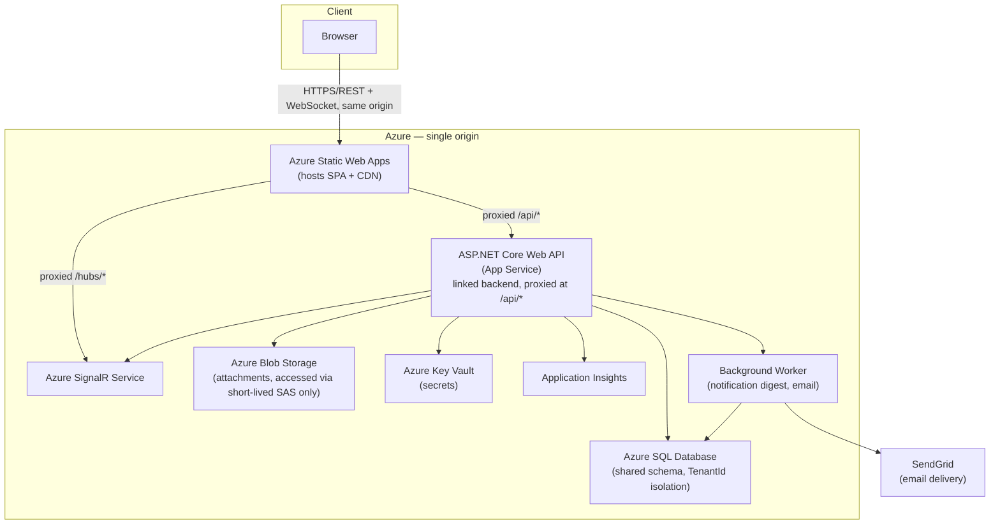
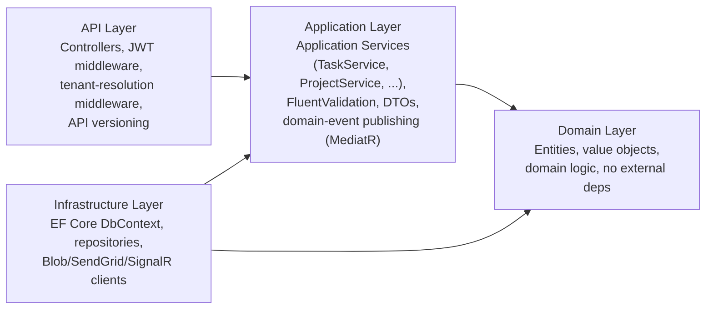
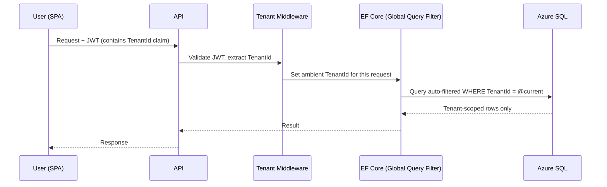

# Architecture

## 1. Stack Summary

| Layer | Choice | Rationale |
|---|---|---|
| Frontend | React 18 + TypeScript, Vite, TanStack Query, Zustand, Tailwind CSS + shadcn/ui | Typed SPA stack; TanStack Query owns server-state caching and is what makes optimistic drag-and-drop board updates tractable ([Engineering Challenges §2](06-engineering-challenges.md)) |
| Backend API | ASP.NET Core 8 Web API, C# | LTS runtime, strong typing, mature ecosystem |
| Backend architecture | Clean Architecture with pragmatic Application Services, FluentValidation; MediatR retained narrowly for post-commit domain-event fan-out | Testable, layered, without paying for full CQRS ceremony on every operation; rationale in [Technical Decisions §1](05-technical-decisions.md) |
| ORM | Entity Framework Core | Global query filters are the enforcement mechanism for tenant isolation — [Security §2](04-security.md#2-tenant-isolation) |
| Database | Azure SQL Database | Managed PaaS, pairs naturally with EF Core, built-in transparent data encryption |
| Real-time | Azure SignalR Service | Managed WebSocket layer for live board updates; rationale in [Technical Decisions §5](05-technical-decisions.md) |
| File storage | Azure Blob Storage | Tenant-scoped, accessed only via server-issued short-lived SAS URLs — never a public URL; [Technical Decisions §10](05-technical-decisions.md) |
| Auth | ASP.NET Core Identity + JWT (access token + cookie-based refresh token) | Self-contained, fully demoable without external IdP setup; same-origin deployment (§2 below) is what makes the refresh cookie safe — [Technical Decisions §3, §6](05-technical-decisions.md) |
| Email | SendGrid | Invite emails, notification digests |
| Secrets | Azure Key Vault | Never in source control or CI logs; substituted locally by .NET User Secrets (§9) |
| Observability | Application Insights + Serilog | Structured logs with correlation IDs, dependency + exception telemetry |
| Hosting | Azure Static Web Apps (SPA) with a **linked backend** proxying `/api/*` to Azure App Service (API) | Both served from one origin — resolves the cross-origin cookie problem at the infrastructure level rather than in application code; [Technical Decisions §6](05-technical-decisions.md) |
| IaC | Bicep | Reproducible environment provisioning |
| CI/CD | GitHub Actions | Build → test → deploy to Azure on merge to `main` |

## 2. Component Diagram



The browser never makes a cross-origin request to reach the API or the SignalR hub — both are proxied through the SPA's own domain via Static Web Apps' linked-backend routing. This is a deliberate infrastructure choice, not an accident of how Azure happens to name default domains; see [Technical Decisions §6](05-technical-decisions.md) for what breaks if it isn't done this way.

## 3. Backend Internal Layering (Clean Architecture)



Dependency rule: `Domain` has no outward dependencies. `Application` depends only on `Domain`. `Infrastructure` implements interfaces defined in `Application`/`Domain`. `API` composes everything at startup via DI. This is what makes the Application layer unit-testable in isolation — services are tested against in-memory fakes of Infrastructure interfaces, with no database or network dependency in the test suite's core.

Application services hold most of the use-case logic directly (one service per aggregate root — `TaskService`, `ProjectService`, `TenantService`), rather than a MediatR command/query handler per operation. MediatR is used inside these services for exactly one thing: publishing a domain event after a successful write, so unrelated side effects (activity logging, notification creation, SignalR broadcast) can react without the service method hard-coding calls to all of them. Full reasoning for this split in [Technical Decisions §1](05-technical-decisions.md).

## 4. Authentication & Tenant Isolation

Sequence for a typical authenticated, tenant-scoped request:



Tenant scoping is not an application-level `if` check a developer could forget to add to a new query — it's a global EF Core query filter applied to every tenant-scoped `DbSet`, so a query that omits it would have to opt out explicitly (`IgnoreQueryFilters()`), which is easy to flag in code review. Full threat model and defense-in-depth detail in [Security §2](04-security.md#2-tenant-isolation).

Role-based authorization is enforced separately, via ASP.NET Core policy-based authorization evaluated against the caller's `TenantMembership.Role` claim, on every mutating endpoint. Details in [Security §3](04-security.md#3-authorization).

The access token is a bearer token attached by the SPA to each request; the refresh token rides in an `HttpOnly, Secure, SameSite=Strict` cookie, which only works reliably because the SPA and API are same-origin (§2) — full detail in [Security §4](04-security.md#4-authentication).

## 5. Real-Time Updates

Task mutations are written through the relevant application service (e.g. `TaskService.UpdateStatusAsync`); on successful commit, the service publishes a domain event via MediatR's lightweight notification pipeline — the one place in the system MediatR is used ([Technical Decisions §1](05-technical-decisions.md)) — which a SignalR hub handler picks up and broadcasts to clients subscribed to that project's board group. This keeps the real-time concern out of the core write path — it's a post-commit side effect, not a blocking dependency of the write. Fan-out scoping (per-project groups, not per-tenant broadcast) and concurrent-edit handling are covered in [Engineering Challenges §2–3](06-engineering-challenges.md).

## 6. Background Processing

A background worker (ASP.NET Core `IHostedService`) handles notification digest emails and invite emails, dispatched asynchronously so API request latency isn't coupled to SendGrid latency. It currently runs in-process alongside the API — a deliberate v1 simplification, not a permanent architecture, since it means digest reliability depends on the App Service plan's "Always On" setting and it shares compute with request handling. The trigger for splitting it into a standalone Azure Function, and why that isn't done preemptively, is documented in [Quality Attributes §2](07-quality-attributes.md#2-scalability). Idempotency approach covered in [Engineering Challenges §5](06-engineering-challenges.md).

## 7. API Versioning & Contract

All endpoints are namespaced `/api/v1/...`. Full resource/endpoint catalog, conventions, and example payloads are in [API Design](03-api-design.md). The API is the sole authorization enforcement point — the SPA's role-based UI hiding is a UX convenience only, never the enforcement point.

## 8. Deployment Pipeline

GitHub Actions workflow: on PR — build, lint, unit + integration tests. On merge to `main` — same checks, then deploy API to Azure App Service and SPA to Azure Static Web Apps (with the linked-backend route configured as part of the SWA deployment), using Bicep-defined infrastructure. Secrets injected from Key Vault at deploy time, never stored in the repo or workflow YAML.

## 9. Local Development

None of the above needs to be live to write and run code day-to-day. The inner loop runs entirely on Docker Compose, with cloud services substituted by local equivalents:

| Cloud service | Local substitute |
|---|---|
| Azure SQL Database | SQL Server container (`mcr.microsoft.com/mssql/server`) |
| Azure Blob Storage | Azurite (Microsoft's official Storage emulator) |
| Azure SignalR Service | ASP.NET Core SignalR's built-in self-hosted mode — no external service needed for a single local instance |
| Azure Key Vault | .NET User Secrets (`dotnet user-secrets`) |
| SendGrid | A local SMTP-capture container (e.g. MailHog/Papercut) so invite/digest emails are viewable in a browser instead of actually sending |
| Application Insights | Console/file Serilog sink only; no telemetry export locally |

```yaml
# docker-compose.yml (illustrative — created when implementation starts)
services:
  sql:
    image: mcr.microsoft.com/mssql/server:2022-latest
    environment:
      ACCEPT_EULA: "Y"
      MSSQL_SA_PASSWORD: "${DEV_DB_PASSWORD}"
    ports: ["1433:1433"]

  azurite:
    image: mcr.microsoft.com/azure-storage/azurite
    ports: ["10000:10000"] # blob endpoint

  mailhog:
    image: mailhog/mailhog
    ports:
      - "1025:1025" # SMTP
      - "8025:8025" # web UI
```

`docker compose up`, then `dotnet run` against connection strings pointed at `localhost` — no Azure subscription, managed identity, or deployed resource is required to build a feature end-to-end. Azure services only enter the loop at deploy time (§8), which keeps the solo-developer inner loop fast and keeps early feature work from being blocked on infrastructure provisioning.
