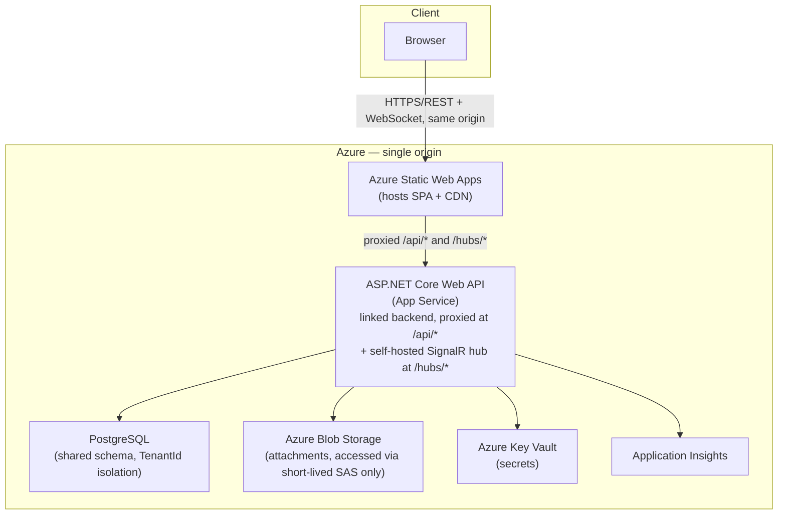
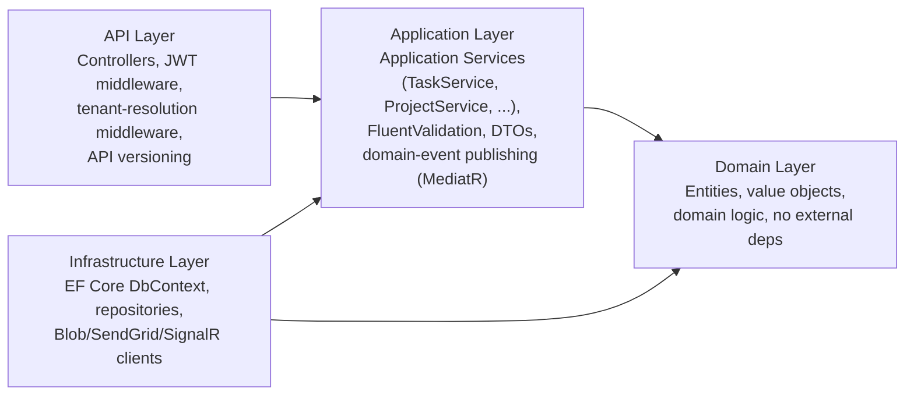
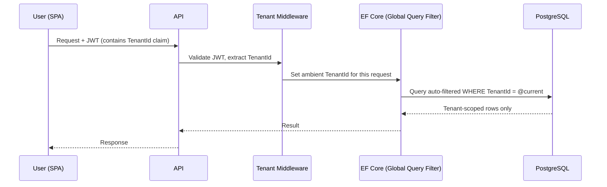

# Architecture

*As-built, not as originally drafted — see the revision notes throughout this document and [Technical Decisions](05-technical-decisions.md) for what changed during implementation and why.*

## 1. Stack Summary

| Layer | Choice | Rationale |
|---|---|---|
| Frontend | React 19 + TypeScript, Vite, TanStack Query, Zustand, Tailwind CSS | Typed SPA stack; TanStack Query owns server-state caching and is what makes optimistic drag-and-drop board updates tractable ([Engineering Challenges §2](06-engineering-challenges.md)). UI primitives (Button, Card, Modal, ...) are hand-rolled, not a component library — no shadcn/ui or icon library, to keep the dependency graph small for a project this size |
| Backend API | ASP.NET Core 8 Web API, C# | LTS runtime, strong typing, mature ecosystem |
| Backend architecture | Clean Architecture with pragmatic Application Services, FluentValidation; MediatR retained narrowly for post-commit domain-event fan-out | Testable, layered, without paying for full CQRS ceremony on every operation; rationale in [Technical Decisions §1](05-technical-decisions.md) |
| ORM | Entity Framework Core | Global query filters are the enforcement mechanism for tenant isolation — [Security §2](04-security.md#2-tenant-isolation) |
| Database | PostgreSQL (Azure Database for PostgreSQL Flexible Server in production) | Managed PaaS, pairs naturally with EF Core (Npgsql), encryption at rest; chosen over Azure SQL/SQL Server for native arm64 Docker support in local development — [Technical Decisions §11](05-technical-decisions.md) |
| Real-time | ASP.NET Core SignalR, self-hosted on the API's own App Service instance | No separate Azure SignalR Service resource — a single-instance simplification, same category as the local/Azure substitution table in §9; see the revision note on [Technical Decisions §5](05-technical-decisions.md) for the tradeoff this accepts |
| File storage | Azure Blob Storage | Tenant-scoped, accessed only via server-issued short-lived SAS URLs — never a public URL; [Technical Decisions §10](05-technical-decisions.md) |
| Auth | ASP.NET Core Identity + JWT | Self-contained, fully demoable without external IdP setup. Access-token-only — no refresh token, no `/auth/logout` — see the revision note in §4 below; a real known limitation, not a documented tradeoff |
| Secrets | Azure Key Vault | Never in source control or CI logs; substituted locally by .NET User Secrets (§9) |
| Observability | Application Insights (via the Azure Monitor OpenTelemetry distro) + Serilog | Structured logs enriched with the request's `TraceIdentifier` via Serilog's `LogContext`, auto-collected request/dependency/exception telemetry |
| Hosting | Azure Static Web Apps (SPA) with a **linked backend** proxying `/api/*` and `/hubs/*` to Azure App Service (API) | Both served from one origin — resolves what would otherwise be a cross-origin cookie problem at the infrastructure level; [Technical Decisions §6](05-technical-decisions.md) |
| IaC | Bicep | Reproducible environment provisioning — see [`infra/`](../../infra/README.md) |
| CI/CD | GitHub Actions | Build → test → deploy to Azure on merge to `main` — see [`.github/workflows/`](../../.github/workflows) |

## 2. Component Diagram



The browser never makes a cross-origin request to reach the API or the SignalR hub — both are proxied through the SPA's own domain via Static Web Apps' linked-backend routing. This is a deliberate infrastructure choice, not an accident of how Azure happens to name default domains; see [Technical Decisions §6](05-technical-decisions.md) for what breaks if it isn't done this way.

## 3. Backend Internal Layering (Clean Architecture)



Dependency rule: `Domain` has no outward dependencies. `Application` depends only on `Domain`. `Infrastructure` implements interfaces defined in `Application`/`Domain`. `API` composes everything at startup via DI. This is what makes the Application layer unit-testable in isolation — services are tested against in-memory fakes of Infrastructure interfaces, with no database or network dependency in the test suite's core.

Application services hold most of the use-case logic directly (one service per aggregate root — `TaskService`, `ProjectService`, `TenantService`), rather than a MediatR command/query handler per operation. MediatR is used inside these services for exactly one thing: publishing a domain event after a successful write, so unrelated side effects (activity logging, notification creation, SignalR broadcast) can react without the service method hard-coding calls to all of them. Full reasoning for this split in [Technical Decisions §1](05-technical-decisions.md).

## 4. Authentication & Tenant Isolation

Sequence for a typical authenticated, tenant-scoped request:



Tenant scoping is not an application-level `if` check a developer could forget to add to a new query — it's a global EF Core query filter applied to every tenant-scoped `DbSet`, so a query that omits it would have to opt out explicitly (`IgnoreQueryFilters()`), which is easy to flag in code review. Full threat model and defense-in-depth detail in [Security §2](04-security.md#2-tenant-isolation).

Role-based authorization is enforced separately, via ASP.NET Core policy-based authorization evaluated against the caller's role claim (issued from `TenantMember.Role` at login), on every mutating endpoint. Details in [Security §3](04-security.md#3-authorization).

**Revision note**: the original design here specified a rotated refresh token in an `HttpOnly, Secure, SameSite=Strict` cookie, renewed via `/auth/refresh`. That was never implemented — as built, `/auth/login` and `/auth/register` issue only a 15-minute JWT access token held client-side, with no refresh mechanism and no `/auth/logout` endpoint. A session simply stops working after 15 minutes and the SPA redirects to `/login` on the resulting 401. This is a real, known gap for anything beyond a demo session, not a documented tradeoff — tracked as a limitation in the root [README](../../README.md#known-limitations), not built here to keep this review focused on fixing what exists rather than adding a new auth flow.

## 5. Real-Time Updates

Task mutations are written through the relevant application service (e.g. `TaskService.UpdateStatusAsync`); on successful commit, the service publishes a domain event via MediatR's lightweight notification pipeline — the one place in the system MediatR is used ([Technical Decisions §1](05-technical-decisions.md)) — which a SignalR hub handler picks up and broadcasts it. This keeps the real-time concern out of the core write path — it's a post-commit side effect, not a blocking dependency of the write.

**Revision note**: fan-out is scoped per-tenant (`TaskHub.GroupName(tenantId)`) plus a per-user group for notification delivery (`TaskHub.UserGroupName(userId)`), not per-project-board as originally drafted here. Every connected client for a tenant receives every task event for that tenant, filtered client-side to whatever board is currently open. Concurrent-edit handling (optimistic concurrency via `TaskItem.Version` + `If-Match`) is covered in [Engineering Challenges §2](06-engineering-challenges.md); the per-tenant (not per-project) broadcast scope and what it costs at higher connection counts is covered in [Engineering Challenges §3](06-engineering-challenges.md).

## 6. Background Processing

**Revision note**: the original design here specified an in-process `IHostedService` dispatching notification digest and invite emails via SendGrid. Neither exists — there is no background worker, no email delivery of any kind, and no digest job. Invitations are created with a raw token returned directly in the API response (`TeamController`), which the inviter shares manually (see [API Design](03-api-design.md)); notifications are in-app only (bell + list), delivered via the same SignalR connection as task events. Email delivery is out of scope for this build, not deferred to a background worker that doesn't exist yet.

## 7. API Versioning & Contract

**Revision note**: the original design here specified `/api/v1/...` namespacing. Endpoints are unversioned (`/api/projects`, `/api/tasks`, ...) — versioning was never load-bearing at this project's stage and was simplified away during implementation; a real `v2` would be introduced only once a breaking change actually needed one. Full resource/endpoint catalog, conventions, and example payloads are in [API Design](03-api-design.md). The API is the sole authorization enforcement point — the SPA's role-based UI hiding is a UX convenience only, never the enforcement point.

## 8. Deployment Pipeline

GitHub Actions workflow: on PR — build, lint, unit + integration tests. On merge to `main` — same checks, then deploy API to Azure App Service and SPA to Azure Static Web Apps (with the linked-backend route configured as part of the SWA deployment), using Bicep-defined infrastructure. Secrets injected from Key Vault at deploy time, never stored in the repo or workflow YAML.

## 9. Local Development

None of the above needs to be live to write and run code day-to-day. The inner loop runs entirely on Docker Compose, with cloud services substituted by local equivalents:

| Cloud service | Local substitute |
|---|---|
| Azure Database for PostgreSQL | PostgreSQL container (`postgres:16`) — see [Technical Decisions §11](05-technical-decisions.md) for why Postgres over SQL Server |
| Azure Blob Storage | Azurite (Microsoft's official Storage emulator) |
| Azure SignalR Service | ASP.NET Core SignalR's built-in self-hosted mode — no external service needed for a single local instance |
| Azure Key Vault | .NET User Secrets (`dotnet user-secrets`) |
| SendGrid | A local SMTP-capture container (e.g. MailHog/Papercut) so invite/digest emails are viewable in a browser instead of actually sending |
| Application Insights | Console/file Serilog sink only; no telemetry export locally |

```yaml
# docker-compose.yml
services:
  postgres:
    image: postgres:16
    environment:
      POSTGRES_USER: devflow
      POSTGRES_PASSWORD: "${DEV_DB_PASSWORD}"
      POSTGRES_DB: devflow
    ports: ["5432:5432"]

  azurite:
    image: mcr.microsoft.com/azure-storage/azurite
    ports: ["10000:10000"] # blob endpoint

  mailhog:
    image: mailhog/mailhog
    ports:
      - "1025:1025" # SMTP
      - "8025:8025" # web UI
```

`docker compose up`, then `dotnet run` against connection strings pointed at `localhost` — no Azure subscription, managed identity, or deployed resource is required to build a feature end-to-end. Azure services only enter the loop at deploy time (§8), which keeps the solo-developer inner loop fast and keeps early feature work from being blocked on infrastructure provisioning.
