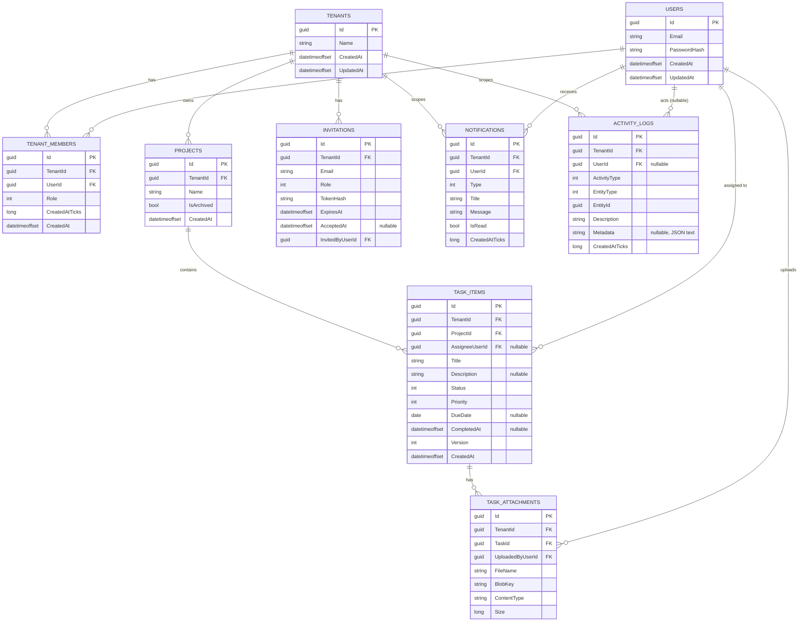

# Database Design

*As-built. An earlier draft of this document modeled a larger schema (comments, tags, a dedicated refresh-tokens table) — see the note at the end of Table Notes for what was cut and why.*

## Tenancy Strategy

**Shared database, shared schema, row-level isolation.** Every tenant-scoped table carries a `TenantId` column (FK to `Tenants`). EF Core global query filters apply `WHERE TenantId = @currentTenant` automatically to every query against those tables (see [Architecture §4](01-architecture.md#4-authentication--tenant-isolation)), and every such table has `TenantId` as the leading column of its indexes so filtered queries stay index-friendly as data grows.

**Why this over the alternatives** (full comparison in [Technical Decisions §2](05-technical-decisions.md)):
- *vs. schema-per-tenant*: avoids migration fan-out (one schema change instead of N).
- *vs. database-per-tenant*: avoids per-tenant provisioning/ops overhead — not justified at this system's scale. This does mean all tenants share one database's compute/IO budget; see the noisy-neighbor tradeoff in [Quality Attributes §2](07-quality-attributes.md#2-scalability).

`Users` is the one table that is **not** tenant-scoped — a user account is global and can hold memberships in multiple tenants via `TenantMembers`.

## Entity-Relationship Diagram

## Table Notes

- **`Tenants`**: root of the tenancy model. No soft-delete/purge flow exists — tenant deletion isn't an implemented feature (see [Security §9](04-security.md#9-data-privacy)).
- **`Users` / `TenantMembers`**: separated so one `User` (one login) can belong to multiple `Tenants`, each with its own `Role`. `Role` is one of `Member | Admin | Owner` (a C# enum, stored as `int`) — a `TenantMembers` invariant, enforced at the application-service level, guarantees a tenant is never left with zero `Owner` members. `CreatedAtTicks` exists purely so `AuthController.Login`'s "pick the earliest-joined membership" query can `ORDER BY` it — SQLite's EF Core provider can't translate ordering by the `DateTimeOffset` `CreatedAt` column directly (same limitation, same fix, as `ActivityLogs`/`Notifications` below).
- **`Invitations`**: pending memberships. Stores `TokenHash`, never the raw token — the raw token is returned to the inviter exactly once, in the create-invitation response body, and never persisted. No background job purges expired rows; `AcceptedAt`/`ExpiresAt` are checked at accept-time instead.
- **`Projects`**: the board is a *computed view*, not a stored entity — the frontend fetches `GET /tasks?projectId=` and groups the result by `Status` client-side. There is no `Boards` table and no `GET /projects/{id}/board` endpoint. An earlier draft of this design modeled `Board` as its own entity (with a `TaskStatuses` table seeded per board); that was collapsed once it was clear every project has exactly one board and the status set is fixed system-wide, not configurable per board (see [Technical Decisions §9](05-technical-decisions.md)).
- **`TaskItems`**: the central entity. `Status` is a plain `int` column backed by a C# enum (`TaskItemStatus { Backlog, ToDo, InProgress, InReview, Done }`) rather than a foreign key to a lookup table — the status set is fixed (see [Technical Decisions §7](05-technical-decisions.md)). `CompletedAt` is set when `Status` transitions to `Done`. `Version` is an **application-managed** optimistic-concurrency counter (incremented in `DevFlowDbContext.SaveChangesAsync` on every update, not a database-generated `rowversion`/`xmin`) — a plain incrementing `int` works identically across every EF Core provider this project targets, including Sqlite in tests, which a database-engine-specific mechanism wouldn't. Exposed to clients via the `If-Match` header on `PATCH /tasks/{id}` — see [API Design §4](03-api-design.md#4-example-status-change-with-conflict-detection).
- **`TaskAttachments`**: stores a `BlobKey` (an opaque, server-generated storage object key), never a public or directly-usable URL. Attachments are served through an authorized download endpoint that checks tenant/task access and hands back a short-lived SAS URL — see [Security §5](04-security.md#5-input-validation--injection-defense) and [Engineering Challenges §7](06-engineering-challenges.md).
- **`Notifications`**: scoped by `TenantId` **and** `UserId` together in its own EF Core query filter — a user only ever sees their own notifications, structurally, not via a per-endpoint check. `CreatedAtTicks`: same SQLite `ORDER BY` limitation as `TenantMembers` above.
- **`ActivityLogs`**: append-only audit trail, written from the application layer as a side effect of every mutating operation. `UserId` is nullable (every activity today has a human actor, but the column doesn't assume that stays true). `Metadata` is JSON stored as plain text, not a provider-specific `jsonb` column — kept portable across Npgsql/Sqlite since only Sqlite runs in this project's tests, and the column is never queried by structure, only stored and displayed.

**What was cut from an earlier draft of this schema**, and why: `TaskComments` (and `@mention`-triggered notifications), `Tags`/`TaskTags`, and a dedicated `RefreshTokens` table were all part of an original, more ambitious design. Comments and tags were never built — descoped to keep the feature set matched to what a solo build could actually finish to a reviewable standard, not because either is architecturally hard. `RefreshTokens` was cut along with the refresh-token auth flow itself — see the revision note in [Architecture §4](01-architecture.md#4-authentication--tenant-isolation).

## Indexing Strategy

- Every tenant-scoped table has an index with `TenantId` as its leading column — `TaskItems(TenantId, ProjectId, Status)` specifically, sized for the board-fetch query (tasks for a project, filtered/grouped by status); `Notifications(TenantId, UserId, IsRead)` for the unread-count query.
- Global full-text search (`GET /api/search`) runs against `Projects`, `TaskItems`, and `TenantMembers` (joined to `Users`) using PostgreSQL's built-in full-text search (`tsvector`/`tsquery`, via Npgsql's `EF.Functions.ToTsVector`/`.Matches`/`.Rank`) in production — see [Technical Decisions §8](05-technical-decisions.md). No dedicated GIN index is provisioned for it yet (the tsvector expression is computed ad hoc per query, not from a persisted/indexed column) — a documented next optimization step, not implemented here, since this sandbox has no PostgreSQL instance to validate an index migration against. SQLite (what this project's tests run against) has no translation path for these functions at all; `LikeSearchService` is the `LIKE`-based substitute the test suite actually exercises — see [Engineering Challenges §6](06-engineering-challenges.md).

## Migrations

EF Core Code-First migrations, checked into source control (`src/DevFlow.Infrastructure/Persistence/Migrations/`). **Not** auto-applied on API startup — a separate, explicit step in the `deploy` GitHub Actions workflow builds a self-contained [EF Core migrations bundle](https://learn.microsoft.com/en-us/ef/core/managing-schemas/migrations/applying?tabs=dotnet-core-cli#bundles) and runs it against the target database before the API deployment step. Full rationale (why not auto-migrate-on-startup) and the exact commands in [`infra/README.md`](../../infra/README.md#migrations-strategy).
