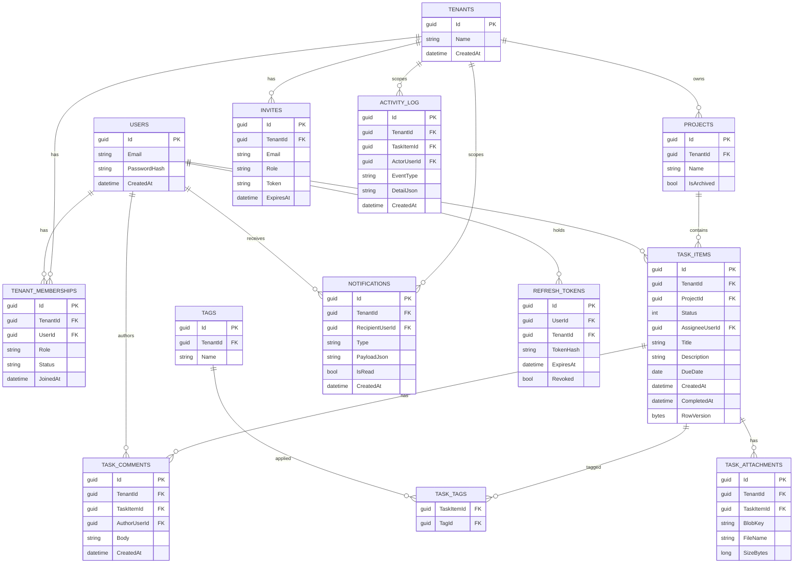

# Database Design

## Tenancy Strategy

**Shared database, shared schema, row-level isolation.** Every tenant-scoped table carries a `TenantId` column (FK to `Tenants`). EF Core global query filters apply `WHERE TenantId = @currentTenant` automatically to every query against those tables (see [Architecture §4](01-architecture.md#4-authentication--tenant-isolation)), and every such table has `TenantId` as the leading column of its primary indexes so filtered queries stay index-friendly as data grows.

**Why this over the alternatives** (full comparison in [Technical Decisions §2](05-technical-decisions.md)):
- *vs. schema-per-tenant*: avoids migration fan-out (one schema change instead of N).
- *vs. database-per-tenant*: avoids per-tenant provisioning/ops overhead — not justified at this system's scale. This does mean all tenants share one database's compute/IO budget; see the noisy-neighbor tradeoff in [Quality Attributes §2](07-quality-attributes.md#2-scalability).

`Users` is the one table that is **not** tenant-scoped — a user account is global and can hold memberships in multiple tenants via `TenantMemberships`.

## Entity-Relationship Diagram

## Table Notes

- **`Tenants`**: root of the tenancy model. Deleting a tenant soft-deletes first (grace period), then cascades a hard purge to all tenant-scoped tables.
- **`Users` / `TenantMemberships`**: separated so one `User` (one login) can belong to multiple `Tenants` with different roles. `Role` is one of `Owner | Admin | Member | Viewer`. A partial unique constraint/check ensures at least one active `Owner` membership per tenant.
- **`Invites`**: pending memberships; a background job purges expired invites past `ExpiresAt`.
- **`Projects`**: the board is a *view*, not a stored entity — a project's Kanban board is simply its `TaskItems` grouped by `Status` at query time. There is no separate `Boards` table. Earlier drafts of this design modeled `Board` as its own entity (with a `TaskStatuses` table seeded per board); that was collapsed into `Projects` directly once it was clear every project has exactly one board and the status set is fixed system-wide, not configurable per board (see [Technical Decisions §9](05-technical-decisions.md)). One less table, one less join on the hottest read path (fetching the board).
- **`TaskItems`**: the central entity. `Status` is a plain `int` column backed by a C# enum (`TaskStatus { Backlog = 0, ToDo = 1, InProgress = 2, InReview = 3, Done = 4 }`) rather than a foreign key to a lookup table — the status set is fixed (see [Technical Decisions §7](05-technical-decisions.md)), so a table and join buy nothing. `CompletedAt` is set when `Status` transitions to `Done`, the enum's defined terminal value — no string-matching or extra flag needed to know which status means "done." `RowVersion` is an EF Core concurrency token used to detect conflicting concurrent edits — see [Engineering Challenges §2](06-engineering-challenges.md).
- **`TaskComments` / `TaskAttachments`**: both carry `TenantId` directly (denormalized from `TaskItem`) rather than requiring a join to enforce isolation — keeps the global query filter uniform across all tenant-scoped tables.
- **`TaskAttachments`**: stores a `BlobKey` (an opaque, server-generated storage object key), never a public or directly-usable URL. Attachments are served through an authorized download endpoint that checks tenant/role access and hands back a short-lived SAS URL — see [Security §5](04-security.md#5-input-validation--injection-defense) and [Engineering Challenges §7](06-engineering-challenges.md).
- **`ActivityLog`**: append-only; written from the application layer as a side effect of every mutating operation.
- **`RefreshTokens`**: `TokenHash` stored, never the raw token; supports per-tenant revocation on membership removal by revoking tokens where `TenantId` matches.

## Indexing Strategy

- Every tenant-scoped table: composite index `(TenantId, Id)` minimum; hot-path tables (`TaskItems`) add `(TenantId, ProjectId, Status)` to serve the board query directly — an integer column comparison, cheaper than the FK join the earlier table-based design would have required.
- `TaskItems(TenantId, ProjectId)` with an included `Title`/`Description` — full-text search uses PostgreSQL's built-in full-text search (`tsvector`/`tsquery`, GIN index) on this scope rather than a separate search service; the point at which that stops being sufficient is discussed in [Engineering Challenges §6](06-engineering-challenges.md).
- `Notifications(TenantId, RecipientUserId, IsRead)` to serve the unread-count query efficiently.

## Migrations

EF Core Code-First migrations, checked into source control, applied automatically on deploy via a startup migration step gated behind an environment flag (never auto-applied in production without the CI/CD pipeline's explicit migration stage).
